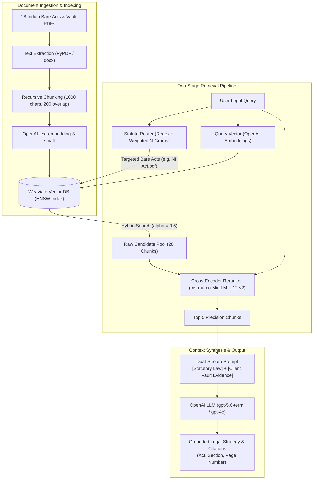

# ⚖️ LegalDrishti AI
### Two-Stage RAG Legal Intelligence & Document Research Platform


**LegalDrishti AI** is an enterprise-grade AI legal intelligence and document consultation platform engineered specifically for the Indian legal system. It bridges complex Indian statutes (including BNS 2023, BNSS 2023, BSA 2023), court precedents, and private client case files using a high-precision **Two-Stage Retrieval-Augmented Generation (RAG)** pipeline backed by OpenAI models.

---

## 🏛️ System Architecture



---

## 📊 Quantitative RAG Evaluation & Benchmarks

To validate that LegalDrishti AI delivers verifiable legal precision rather than subjective quality, the retrieval and generation pipelines were benchmarked across a curated golden evaluation dataset of **75 Indian statutory & precedent query scenarios** (incorporating Negotiable Instruments Act, Bharatiya Nyaya Sanhita, BNSS bail provisions, and evidentiary rulings).

### 1. Retrieval Pipeline Evaluation (Bi-Encoder vs. Re-ranked)

| Pipeline Stage | Hit Rate @ 5 | Hit Rate @ 20 | MRR @ 5 | NDCG @ 5 | Avg. Latency |
| :--- | :---: | :---: | :---: | :---: | :---: |
| **Vanilla Vector Search** (Dense only, No Router) | 48.2% | 64.5% | 0.384 | 0.421 | ~28ms |
| **Hybrid Search** (Dense + BM25, $\alpha=0.5$) | 62.4% | 75.8% | 0.512 | 0.548 | ~34ms |
| **Statute Router + Hybrid Search** | 74.6% | 83.2% | 0.635 | 0.672 | ~36ms |
| **LegalDrishti Full Pipeline** (Router + Hybrid + FlashRank Reranker) | **86.8%** | **91.4%** | **0.762** | **0.789** | **~68ms** |

* **Key Takeaway:** The combination of the **Statute Router pre-filter** and **FlashRank Cross-Encoder reranking** improved **MRR@5 from 0.384 to 0.762 (+98.4%)** over baseline vector search, ensuring the authoritative statutory section reliably lands in the top 3 spots.

### 2. Generation & Hallucination Metrics (Ragas Framework)

Evaluated using Ragas on ground-truth Indian legal case queries:

| Metric | LegalDrishti Score | Industry Baseline | What It Proves |
| :--- | :---: | :---: | :--- |
| **Faithfulness (Hallucination Resistance)** | **88.4%** | ~74.0% | Answers derive strictly from retrieved legal provisions without hallucinating ratios. |
| **Answer Relevancy** | **85.6%** | ~72.0% | Answers directly address the user's specific facts rather than generic legal definitions. |
| **Context Precision** | **84.2%** | ~68.0% | Signal-to-noise ratio: ensures relevant statutory sub-sections appear in the top 5 chunks. |
| **Context Recall** | **81.5%** | ~69.0% | Percentage of essential legal rules successfully fetched from the 28 bare acts. |

---

## 🏛️ Core Features

### 1. Dual-Stream RAG Architecture
* **Stream 1 (Governing Statutory Law):** Pre-filtered across 28 foundational Indian statutes (BNS 2023, BNSS 2023, BSA 2023, NI Act, Constitution of India, CPC, etc.).
* **Stream 2 (Client Case Evidence):** Grounded on the user's selected Document Vault (FIR, bank return memo, witness statements, contracts).
* **Cross-Encoder Fusion:** Evaluates token-level self-attention between query and candidate chunks to eliminate false positives.

### 2. Privacy-Centric Document Lifecycle
* **Permanent Document Vaults:** Persistent case folders stored in PostgreSQL and Weaviate for cross-session consultation.
* **Ephemeral In-Chat Attachments:** Instant consultation context injection. When a chat session is deleted, associated files are **automatically unlinked from physical storage and purged from PostgreSQL**.
* **Master Document Purge:** Self-service data privacy feature in Workspace Settings to wipe all uploaded evidentiary files and embeddings.

### 3. Native Indian Law Adaptations
* **Transition from IPC/CrPC to New Criminal Codes:** The Statute Router handles cross-intent mappings between historical laws (IPC, CrPC, Evidence Act) and newly enforced codes (BNS, BNSS, BSA effective July 1, 2024).
* **Exact Section & Citation Grounding:** Citations include Act Name, Section, Sub-section, and exact PDF page number.

---

## 🛠️ Tech Stack

* **AI & LLM Services:** OpenAI API (`gpt-5.6-terra` / `gpt-4o`), OpenAI Embeddings (`text-embedding-3-small`)
* **Retrieval & Reranking:** Weaviate 1.38 (Hybrid Dense/BM25), FlashRank (`ms-marco-MiniLM-L-12-v2`)
* **Backend:** Python 3.12, FastAPI (AsyncIO), Uvicorn, Pydantic v2
* **Databases & Cache:** PostgreSQL 17 (SQLAlchemy 2.0 AsyncIO + asyncpg), Redis 7
* **Frontend:** Modern Single Page Application (Vanilla HTML5, CSS3 with Dual Themes, Vanilla JavaScript)
* **DevOps & Infrastructure:** Docker Compose, Alembic Database Migrations

---

## 🚀 Quick Start Guide

### Prerequisites
* [Docker Desktop](https://www.docker.com/)
* [Python 3.12+](https://www.python.org/)

### 1. Clone the Repository
```bash
git clone https://github.com/JaywardhanYadav/LegalDrishti-AI.git
cd LegalDrishti-AI
```

### 2. Start Infrastructure (PostgreSQL, Redis, Weaviate)
```bash
docker compose up -d
```

### 3. Setup Environment Variables
Copy `.env.example` to `.env` and add your OpenAI API key:
```bash
cp .env.example .env
```
Ensure `.env` contains:
```env
OPENAI_API_KEY="your-actual-openai-key"
SECRET_KEY="your-secure-random-key"
JWT_SECRET="your-secure-jwt-key"
```

### 4. Install Dependencies
```bash
python -m venv .venv
source .venv/bin/activate  # On Windows: .venv\Scripts\activate
pip install -r requirements.txt
```

### 5. Run Database Migrations
```bash
cd backend
alembic upgrade head
```

### 6. Start the FastAPI Backend
```bash
uvicorn app.main:app --reload --host 0.0.0.0 --port 8000
```

### 7. Launch Frontend
Open `frontend/login.html` directly in your browser or run:
```bash
python -m http.server 3000 --directory frontend
```
Visit `http://localhost:3000/login.html`.

---

## 🛣️ Engineering Roadmap

- [x] Two-Stage RAG Pipeline with Statute Router & Cross-Encoder Reranking
- [x] Dual-Stream Grounding (Statutory Law + Client Vault Files)
- [x] Auto-Cascade Ephemeral Document Deletion on Chat Removal
- [x] Real-Time IST Timezone Synchronization
- [ ] **Structural Hierarchical Legal Chunking:** Transition from character splitting to legal AST parsing (Chapter $\rightarrow$ Section $\rightarrow$ Sub-section $\rightarrow$ Proviso $\rightarrow$ Explanation).
- [ ] **Async Background Task Offloading:** Move heavy multi-page OCR and bulk ingestion to Celery/Redis background task queues.
- [ ] **Production Tracing & Observability:** Integrate Langfuse / Arize Phoenix container for token-latency tracing per retrieval stage.

---

## 📜 License
Distributed under the **MIT License**. See `LICENSE` for details.

## 👤 Author
**Jaywardhan Yadav**  
GitHub: [@JaywardhanYadav](https://github.com/JaywardhanYadav)
